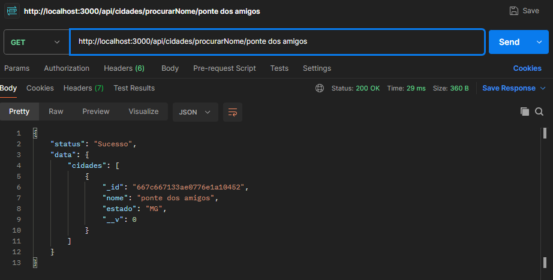

## Progress Report: Projeto API

- Durante este projeto eu desenvolvi uma API que gerencia dados de clientes e cidades em um banco de dados, permitindo que o usuário faça consultas, alterações em nomes e remoção de clientes. Neste projeto o banco de dados utilizado foi o MongoDB.

## Pré-Requisitos:

- Node.js
- Docker

## Configurações Iniciais
- Para que seja possivel utilizar a aplicação, primeiro deve-se clonar o repositório remoto para a sua máqui local. Isso pode ser realizado através do comando:

```git clone```

- Para executar devemos utilizar o comando

```npm install```

- Após executar o comando, as bibliotecas utilizadas pela apicação serão instaladas e com isso basta configurar as váriaveis de ambiente criando um arquivo ```.env``` e preencha de acordo com ```.env.example```

## Como Utilizar:

- Para inicializar basta utilizar o comando:    ```npm run start``` 

## Funcionalidades

- Cadastrar cliente
- Consultar cliente pelo nome
- Consultar cliente pelo ID
- Remover cliente
- Alterar nome do cliente
- Cadastrar cidade
- Consultar cidade pelo nome
- Consultar cidade pelo estado

## Dados necessários para cadastrar um cliente:

Para cadastrar um cliente é nescessário informar os seguintes dados:

- Nome
- Gênero
- Aniversário
- Cidade

Para cadastrar uma cidade é nescessário informar os seguintes dados:

- Nome
- Estado

## Exemplos de Uso: 

## Cadastrar um Cliente

- Primeiro, para criamos um cliente na rota utilizamos o comando: ```api/clientes/criarusuario``` com o método ```POST```, utilizando um JSON:

```javascript
{
    "nome": "Fellype Ferreira",
    "genero": "Homem",
    "aniversario": "2000-02-18",
    "cidade": "Vargem Alegre",
  }
``` 


## Consultar cliente
- Podemos consultar todos os clientes utilizando o método ```GET``` na rota ```api/clientes/mostrartodos```


- Além disso, podemos consultar os clientes por ```NOME``` ou por ```ÍD```:


## Alterar nome do cliente

- Utilizando  o método ```PATCH``` na rota ```api/clientes/mudarNome/:id'``` podemos alterar o nome de um cliente utilizando o ID.


- Caso o ID do cliente esteja incorreto, mostramos essa mensagem de erro


## Remover cliente

- Com o método ```Delete``` na rota ```api/clientes/deletar/:id```, podemos deletar o cliente que corresponde ao ID especificado na rota.

## Cadastro de cidade
- Todo cliente pode cadastrar uma cidade acessando a rota ```api/cidades/criarCidade``` com o método ```POST``` e um JSON  da seguinte forma:

```javascript
{
    "nome": "Felicidade",
    "estado": "BH"
}
``` 


## Consultar cidade
- O cliente pode também consultar todas as cidades com o método ```GET``` na rota ```api/cidades/mostrarCidades```:


- Além disso, ele também pode filtrar a busca pelo nome da cidade, com o comando ```api/cidades/procurarNome/:nome```:



- E também pode filtrar todas as cidades pelo estado, com o comando ```api/cidades/procurarEstado/:estado```:


## Códigos de retorno

Dentro desta API se integram as seguintes operações:

- 200 - Success
- 201 - Created
- 204 - No Content
- 404 - Not found
- 500 - Internal Server Error

